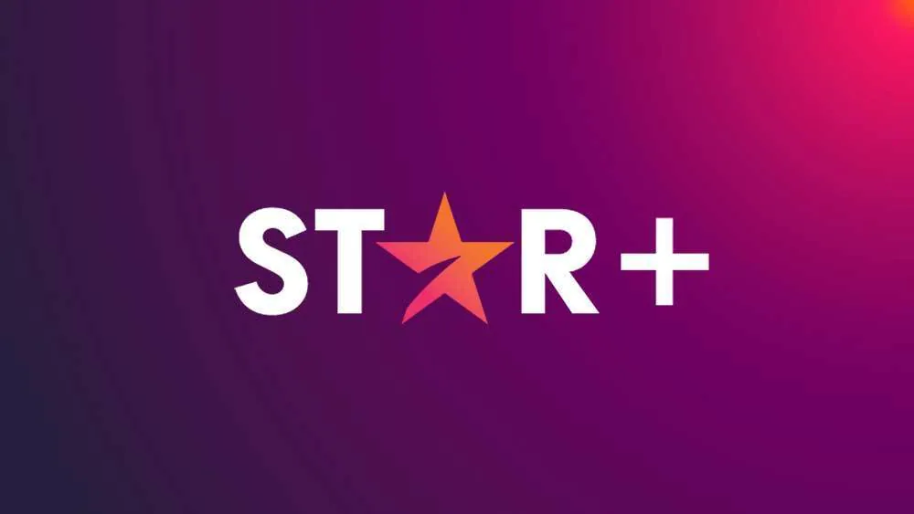

## Sobre o StarPlus

Star+ é um serviço de streaming por assinatura de entretenimento e esportes da The Walt Disney Company, lançado em 31 de agosto de 2021 na América Latina, incluindo o Brasil. É um serviço separado para o público adulto somente nesta região.

O serviço tem estreias de séries de televisão e filmes exclusivos produzidos pela The Walt Disney Company. O Star+ inclui produções da ABC Signature, 20th Television e 20th Television Animation, e conteúdo das emissoras ABC, FX, Hulu e Freeform. Filmes produzidos pelos estúdios de cinema 20th Century, Searchlight, Touchstone, Hollywood e Caravan Pictures também estão no serviço. Além de todos eles, o serviço de streaming inclui esportes ao vivo da ESPN.

O serviço também tem uma programação original exclusiva do Star (o serviço complementar do Disney+ no Canadá, Europa Ocidental e partes da Ásia-Pacífico), além de uma coleção de produções originais da região.

